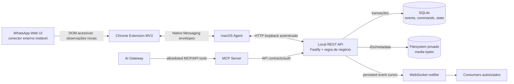

# Diagrama de componentes

```mermaid
flowchart LR
  WA[WhatsApp Web UI<br/>conector externo instável] -->|DOM acessível; observações novas| EXT[Chrome Extension MV3]
  EXT <-->|Native Messaging envelopes| MAC[macOS Agent]
  MAC <-->|HTTP loopback autenticado| API[Local REST API<br/>Fastify + regra de negócio]
  API -->|transações| DB[(SQLite<br/>events, commands, state)]
  API -->|IDs/metadata| FS[(Filesystem privado<br/>media bytes)]
  API -->|persisted event cursor| WS[WebSocket notifier]
  WS --> Consumers[Consumers autorizados]
  MCP[MCP Server] -->|API contracts/auth| API
  AI[AI Gateway] -->|allowlisted MCP/API tools| MCP
```

Chrome Extension e WhatsApp Web não têm caminho para SQLite/filesystem privado. MCP não tem conexão DB. Setas mostram contratos planejados, não código já entregue.
